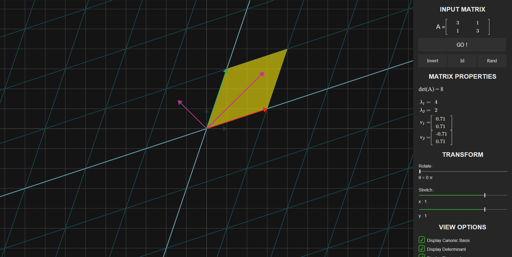

# Matransform - Visualize 2D Matrix Transformations

## Description

*Matransform* is a tool to visualize 2D matrix transformations with nice animations.

This was inspired by Grant Sanderson's amazing work on
[Essence of Linear Algebra](https://www.youtube.com/playlist?list=PLZHQObOWTQDPD3MizzM2xVFitgF8hE_ab)
YouTube videos (on [3blue1brown](https://www.youtube.com/c/3blue1brown) channel).

[CLICK HERE TO TRY IT ONLINE !](https://teskann.github.io/matransform/index.html)

## Features

*Matransform* offers the following features :
 - Matrix text entry
 - Animation of the transformation (clicking on "GO !")
 - Matrix inversion (clicking on "Invert")
 - Come back to the identity matrix (clicking on "Id")
 - Random matrix generation (clicking on "Rand")
 - Display and plot the determinant (even during the animation)
 - Display and plot the eigenvalues, including complex ones (even during the animation)
 - Display and plot eigenvectors, including complex ones (even during the animation)
 - Rotate matrix
 - Stretch matrix (x and y directions)
 - Possibility to change animations duration

## About

This has been created for educational purposes, to help students understanding
basics of linear algebra. It's recommended to watch
[Essence of Linear Algebra](https://www.youtube.com/playlist?list=PLZHQObOWTQDPD3MizzM2xVFitgF8hE_ab)
Youtube videos before using *Matransform* to understand the theory behind it.